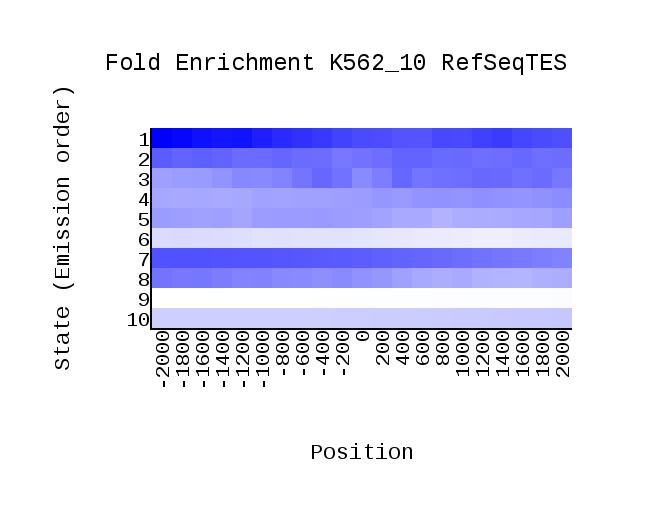

# hse_hw3_chromhmm

## Метки

| Название метки | Файл                   |
|----------------|------------------------|
| H3k27ac        | H3k27acStdAlnRep1.bam  |
| H3k27me3       | H3k27me3StdAlnRep1.bam |
| H3k36me3       | H3k36me3StdAlnRep1.bam |
| H3k4me1        | H3k4me1StdAlnRep1.bam  |
| H3k4me2        | H3k4me2StdAlnRep1.bam  |
| H3k4me3        | H3k4me3StdAlnRep1.bam  |
| H3k79me2       | H3k79me2StdAlnRep1.bam |
| H3k9ac         | H3k9acStdAlnRep1.bam   |
| H3k9me1        | H3k9me1StdAlnRep1.bam  |
| H3k9me3        | H3k9me3StdAlnRep1.bam  |

## Выдача ChromHMM

## Примеры из genome browser

## Табличка с результатами

| Номер состояния | Присвоенная роль                   | Ассоциированные метки                                                    | Уровень CpG | Уровень Lamina | Другое                                                         |
|-----------------|------------------------------------|--------------------------------------------------------------------------|-------------|----------------|----------------------------------------------------------------|
|               1 | Transcribed Promoter, high expr    | H3k79me2 H3k36me3 H3k9me1 H3k4me1 H3k27ac H3k9ac H3k4me2 H3k4me3         | Высокий     | Низкий         |                                                                |
|               2 | Transcribed Promoter, highest expr | H3k79me2 H3k9me1 H3k4me1 H3k27ac H3k9ac H3k4me2 H3k4me3                  | Высокий     | Средний        |                                                                |
|               3 | Transcribed 5' proximal            | H3k79me2 H3k36me3 H3k9me1 H3k4me1 H3k27ac H3k9ac H3k4me2 H3k4me3 H3k9me3 | Низкий      | Средний        | Низкий процент от генома, низкий TSS                           |
|               4 | Promoter upstream                  | H3k9me1 H3k4me1 H3k27ac H3k4me2 H3k4me3                                  | Средний     | Средний        |                                                                |
|               5 | Transcribed 5' proximal            | H3k79me2 H3k36me3 H3k9me1 H3k4me1 H3k27ac H3k9ac H3k4me2 H3k4me3 H3k9me3 | Низкий      | Низкий         | Часто находится на гене                                        |
|               6 | Transcribed 5' proximal            | H3k79me2 H3k36me3 H3k9me1 H3k4me1 H3k9me3                                | Низкий      | Низкий         | Часто находится на гене                                        |
|               7 | Transcribed 5' distal              | H3k79me2 H3k36me3 H3k9me1                                                | Низкий      | Средний        | Часто находится на гене, занимает видимый процент всего генома |
|               8 | Repetetive                         | H3k36me3 H3k9me1 H3k4me1 H3k27ac H3k9me3                                 | Низкий      | Высокий        | Низкий процент от генома, низкий TSS                           |
|               9 | Repressed                          | –                                                                        | Низкий      | Высокий        | Очень высокий процент от генома                                |
|              10 | Repressed                          | H3k9me1 H3k27me3                                                         | Низкий      | Высокий        | Очень высокий процент от генома                                |
